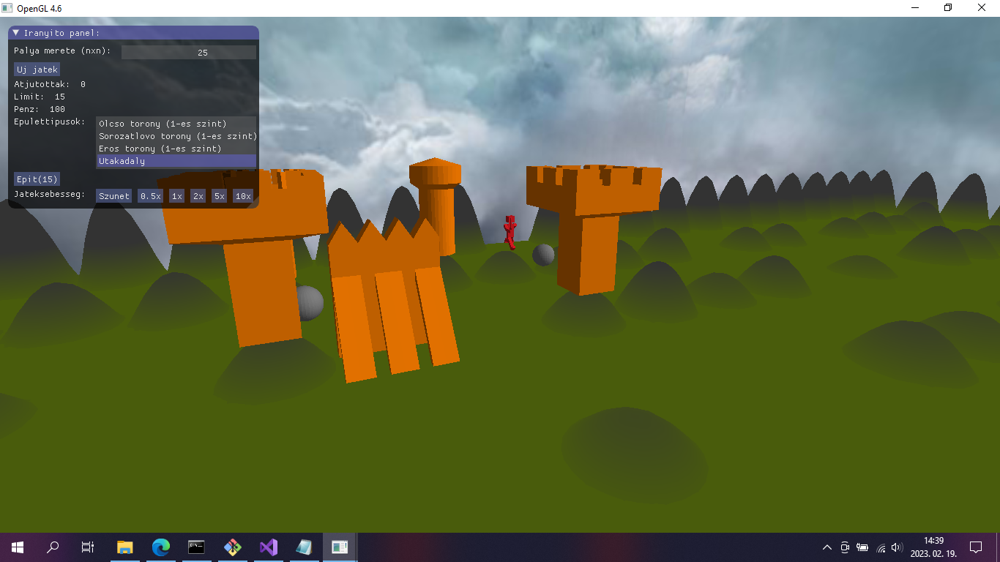

<h1>Egyszerű Tower Defense játék</h1>

Egy egyszerű tower defense játék, amit C++-ban írtam OpenGL-el Visual Studio IDE-ben.

A játék célja:
Építs tornyokat a dombokra és útakadályokat a köztük lévő üres mezőkre, hogy minél tovább visszatartsd az ellenségeket a pálya végétől. Ha 15 ellenség eljut a pálya végéig, a játék véget ér.

Irányítás:
<ul>
<li>Tartsd nyomba a bal egérgombot és húzd el az egeret a kamera forgatásához.</li>
<li>A WASD gombokkal mozgathatod a kamerát.</li>
<li>Az építkezést, az épületek fejlesztését és a játékbeállításokat a játékképernyőn megjelenő ImGUI ablakban lehet kezelni egérrel.</li>
</ul>

Futtatás:
1. Nyiss egy parancssort és írd be, hogy: subst t: útvonal\Basic-Tower-Defense-Game\01_OGLBase\includes
2. Buildeld és futtasd a projektet Visual Studio-ban.
3. A program IDE-ből isfut, de buildelés után megnyitható a Basic-Tower-Defense-Game\x64\Debug mappában is.
4. Hogy töröld a virtuális T meghajtót, menj vissza a parancssorba és írd be, hogy: subst \D t:

Szerzői jogok: Ez a játék az ELTE Informatikai kara által fejlesztett OGLBase keretrendszer segítségével készült, ezért a program pénzért való továbbadása tilos.
